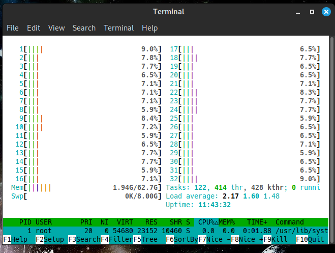

# Virtual Ecosystem Simulation

 <br/> 
*Example simulation visualization*

## Overview

This project is a Rust implementation of a parallel virtual ecosystem simulation featuring:

- Multiple being types (Herbivores, Carnivores, Omnivores) with distinct behaviors
- Genetic traits that evolve over generations
- Food sources that spawn dynamically
- Parallel computation using Rayon for efficient multi-core utilization 
- Real-time visualization using Piston graphics
- Dedicated stats display area with comprehensive metrics

## Key Updates

### Behavior Enforcement System
- **Cannibalism Prevention**: Beings will no longer target others of their own type
- **Type-Specific Interactions**:
  - Herbivores only interact with food
  - Carnivores only hunt herbivores and omnivores
  - Omnivores have balanced hunting/foraging behavior
- **Size-Based Hunting**: Predators only target beings smaller than themselves

### Enhanced Statistics Display
- Dedicated stats panel above simulation area
- Real-time population counts by type
- Food availability tracking
- Thread utilization metrics
- Average energy levels
- Birth/death counters

### Improved Visualization
- Clean separation between stats and simulation areas
- Optimized rendering pipeline
- Consistent color coding:
  - Blue: Herbivores
  - Red: Carnivores  
  - Orange: Omnivores
  - Green: Food sources

## Being Types
| Type        | Color | Behavior | Diet | Special Traits |
|-------------|-------|----------|------|----------------|
| Herbivore   | Blue  | Passive  | Plants | High perception for food |
| Carnivore   | Red   | Aggressive | Other beings | Fast movement, high attack |
| Omnivore    | Orange | Adaptive | Mixed | Balanced abilities |

## Genetic System
- **Inheritable Traits**:
  - Speed (Movement capability)
  - Size (Affects hunting ability)  
  - Reproduction Rate
  - Perception (Detection range)
- **Mutation**: Small random variations in offspring
- **Natural Selection**: Successful traits propagate through generations


- **Ecosystem Dynamics**:
  - Energy-based lifecycle (consumption, metabolism, reproduction)
  - Age-based mortality
  - Population limits

- **Parallel Processing**:
  - Multi-core being updates using Rayon
  - Thread-safe food management
  - Configurable thread count
  - By default utilizing all of CPU threads and cores regardless of their number 

 <br/>
*Example of all my 32 CPU threads used evenly (Ryzen 5950X)*


## Stats Panel Information

The header displays real-time information:
```
Population: 120 (H:80 C:20 O:20) | Food: 450 | Threads: 8
```
- **Population**: Total beings (with counts by type)
    
- **Food**: Available food sources
    
- **Threads**: Active worker threads

## Requirements

- Rust 1.60+
- Cargo
- TrueType font file (for stats display, optional)

## Installation

1. Clone the repository:
   ```bash
   git clone https://github.com/yourusername/virtual-ecosystem.git
   cd virtual-ecosystem
   ```

2. Add a font file (optional):
   ```bash
   mkdir assets
   cp /path/to/your/font.ttf assets/FiraSans-Regular.ttf
   ```

3. Build and run:
   ```bash
   cargo run --release
   ```
## Running the Virtual Ecosystem Simulation on Windows

Here's a complete guide to getting the simulation running on Windows systems:

## Prerequisites

1. **Install Rust**:
   - Download the [Rust installer](https://www.rust-lang.org/tools/install)
   - Run the installer and follow the prompts
   - Ensure you select the option to add Rust to your PATH

2. **Install Visual Studio Build Tools** (required for Rust on Windows):
   - Download [Build Tools for Visual Studio](https://visualstudio.microsoft.com/downloads/#build-tools-for-visual-studio-2022)
   - Install with these components:
     - "Desktop development with C++"
     - Windows 10/11 SDK

## Running the Simulation

1. **Open Command Prompt**:
   - Press `Win + R`, type `cmd`, and press Enter

2. **Clone and run the project**:
   ```cmd
   git clone https://github.com/yourusername/virtual-ecosystem.git
   cd virtual-ecosystem
   cargo run --release
   ```

## Alternative: Using Windows Subsystem for Linux (WSL)

For better performance and Linux-like environment:

1. **Install WSL**:
   ```powershell
   wsl --install
   ```
   Restart your computer when prompted

2. **Install Rust in WSL**:
   ```bash
   curl --proto '=https' --tlsv1.2 -sSf https://sh.rustup.rs | sh
   ```

3. **Run the simulation**:
   ```bash
   git clone https://github.com/yourusername/virtual-ecosystem.git
   cd virtual-ecosystem
   cargo run --release
   ```

## Common Windows Issues and Solutions

1. **Linker errors**:
   - Ensure Visual Studio Build Tools are installed
   - Run in Visual Studio Developer Command Prompt if needed

2. **Font issues**:
   ```cmd
   mkdir assets
   copy C:\Windows\Fonts\arial.ttf assets\FiraSans-Regular.ttf
   ```

3. **Performance problems**:
   - Add this to `Cargo.toml`:
     ```toml
     [profile.release]
     lto = true
     codegen-units = 1
     ```

## Windows-Specific Optimizations

1. **Disable console window** (for release builds):
   Add this to `Cargo.toml`:
   ```toml
   [profile.release]
   strip = true
   ```

2. **Window scaling**:
   If the window appears too small, modify:
   ```rust
   const WINDOW_SIZE: f64 = 1200.0; // Increase from 800.0
   ```

3. **High DPI support**:
   Add early in `main()`:
   ```rust
   use winit::dpi::LogicalSize;
   window.set_inner_size(LogicalSize::new(WINDOW_SIZE, WINDOW_SIZE));
   ```

## Creating a Windows Executable

To build a standalone `.exe`:

```cmd
cargo build --release
```

The executable will be at:
```
target\release\virtual-ecosystem.exe
```

You can distribute this file along with any required assets (like the font file).


## Configuration of the simulation

Modify these constants in `main.rs` to adjust simulation parameters:

```rust
const WINDOW_SIZE: f64 = 800.0;          // Simulation window size
const BASE_BEING_SIZE: f64 = 10.0;       // Base size for beings
const MAX_BEINGS: usize = 260;           // Maximum population
const MAX_FOOD: usize = 990;             // Maximum food items
const FOOD_SPAWN_RATE: f64 = 0.99;       // Food spawn probability
const ENERGY_DECAY: f32 = 0.000001;      // Energy loss rate
```

## Controls

- **ESC**: Exit simulation
- Window close: Exit simulation

## Performance Notes

The simulation automatically scales to use available CPU cores. For best performance:

1. Use `--release` flag for optimized builds
2. Larger populations (>100 beings) benefit most from parallelization
3. Stats display shows active thread count

 Build and tested on Fedora 40 with Ryzen R9 5950X

## Customization

To modify being behaviors, adjust the update methods in:
- `update_herbivore()`
- `update_carnivore()`
- `update_omnivore()`

## License

MIT License - See [LICENSE](LICENSE) for details.
